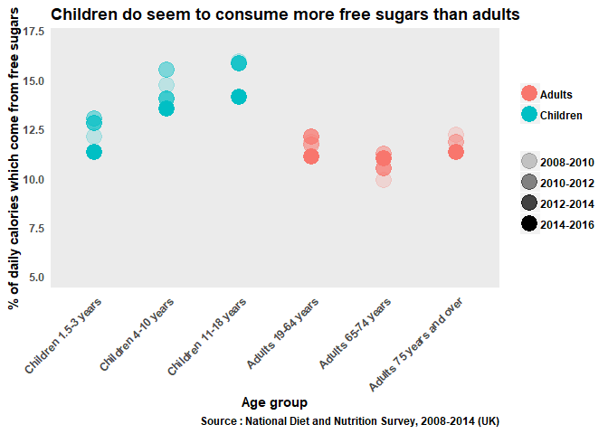
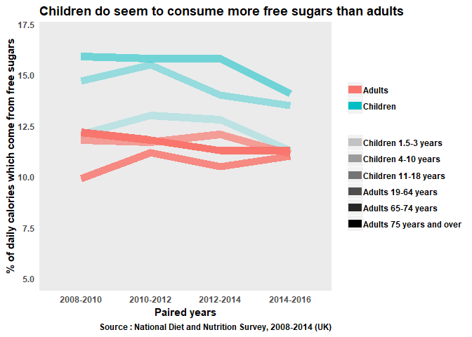
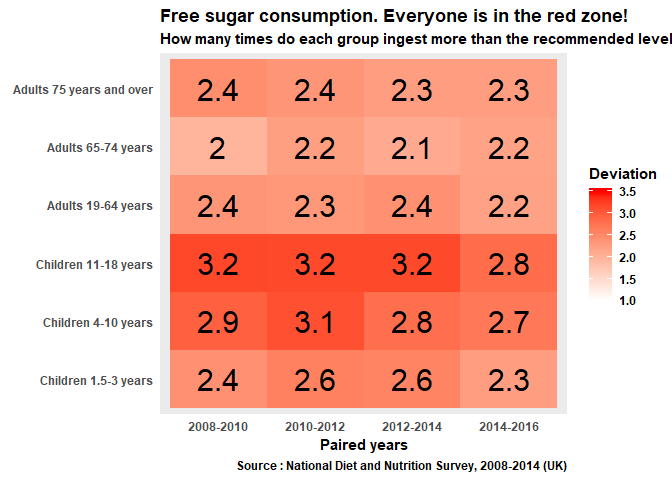

Makeover Monday Feb11
================
Steve Carufel
February 16, 2020

### The (small) dataset : Is it time to treat sugar like smoking?

The dataset can be grabbed here : <https://data.world/makeovermonday/2020w3-is-it-time-to-treat-sugar-like-smoking>

Loading some packages first.

``` r
library(httr)
library(readxl)
library(tidyverse)
library(RColorBrewer)
```

Getting the data.

``` r
GET("https://query.data.world/s/xeuu2paegkke62iu4sc2x76dkbyder", write_disk(tf <- tempfile(fileext = ".xlsx")))
```

``` r
df <- read_excel(tf)
```

Taking a look at the data.

``` r
print(df)
```

    ## # A tibble: 15 x 5
    ##    `Free sugars in~ `(2008/09 - 200~ `(2010/11 - 201~ `(2012/13 - 201~
    ##    <chr>                       <dbl>            <dbl>            <dbl>
    ##  1 Children 1.5-3 ~             12.1             13               12.8
    ##  2 Children 4-10 y~             14.7             15.5             14  
    ##  3 Children 11-18 ~             15.9             15.8             15.8
    ##  4 Adults 19-64 ye~             11.8             11.7             12.1
    ##  5 Men 19-64 years              12               12.3             12.5
    ##  6 Women 19-64 yea~             11.6             11.2             11.6
    ##  7 Adults 65 years~             10.9             11.4             10.8
    ##  8 Men 65 years an~              9.7             11               11.6
    ##  9 Women 65 years ~             10.1             11.3              9.5
    ## 10 Adults 65-74 ye~              9.9             11.2             10.5
    ## 11 Men 65-74 years               9.7             11               11.6
    ## 12 Women 65-74 yea~             10.1             11.3              9.5
    ## 13 Adults 75 years~             12.2             11.8             11.3
    ## 14 Men 75 years an~             11.8             12.3             11.5
    ## 15 Women 75 years ~             12.4             11.2             11.2
    ## # ... with 1 more variable: `(2014/15-2015/16)` <dbl>

Some duplicates we can't compare, like Men 65 years old and over and Men 65-74 years old and over. We'll just compare the most we can with no overlapping categories.

``` r
df_agegroups <- rbind(df[1:4,], df[10,], df[13,])
```

Column names are a bit messy.

``` r
colnames(df_agegroups) <- c("Age", "2008-2010", "2010-2012", "2012-2014", "2014-2016")
print(colnames(df_agegroups))
```

    ## [1] "Age"       "2008-2010" "2010-2012" "2012-2014" "2014-2016"

We need to put the data into a long format, as opposed to the wide format.

``` r
df_tidy_age <- gather(df_agegroups, paired_years, proportion, -Age)

df_tidy_age$Age <- factor(df_tidy_age$Age, levels = c("Children 1.5-3 years", "Children 4-10 years", "Children 11-18 years", "Adults 19-64 years", "Adults 65-74 years", "Adults 75 years and over"))
```

Now in my vizzes I'd like children and adults to have a group color. This way below, R looks into the first column and gives back a TRUE statement if he detects the word "Children" and a FALSE if he doesn't - meaning our Adults here.

``` r
df_tidy_age$IsItChild <- as.character(str_detect(df_tidy_age$Age, "Children"))
df_tidy_age$IsItChild <- str_replace(df_tidy_age$IsItChild, "TRUE", "Children")
df_tidy_age$IsItChild <- str_replace(df_tidy_age$IsItChild, "FALSE", "Adults")
```

Let's make some sort of plot in which it will be easy to see the picture per age group, and compare them between them. I'll get a message telling me using transparency for discrete variables is not advised, but in this case I think it's appropriate.

In the following viz, the darker a dot, the more recency the time period has. Shown as below, I just thought this would be a quick way to show the range of proportional sugar consumption each age group have been consuming.

``` r
ggplot(df_tidy_age, aes(x = Age, y = proportion, col = IsItChild)) +
  geom_point(aes(alpha = paired_years), size = 6) +
  # Transparency - known as alpha in jargon
  scale_alpha_discrete(range = c(0.2, 1)) +
  # Labels on the X acis looked weird since they are long, so we'll rotate them a bit
  theme(
    text = element_text(face = "bold"),
    axis.text.x = element_text(
      angle = 45, 
      vjust = 1, 
      hjust = 1
      ),
    panel.grid = element_blank(),
    axis.ticks = element_blank(),
    legend.title=element_blank()
    ) +
  # Choosing our labels ourselves. By default R will put the variables names
  labs(
    x = "Age group", 
    y = "% of daily calories which come from free sugars",
    title = "Children do seem to consume more free sugars than adults",
    caption = "Source : National Diet and Nutrition Survey, 2008-2014 (UK)") +
  coord_cartesian(ylim = c(5, 17)) # 5 % being the recommended maximum proportion
```

    ## Warning: Using alpha for a discrete variable is not advised.



Cool. Now let's try something else. Like a timeline - which is pretty much our previous viz that is being rotated, sort of.

``` r
ggplot(df_tidy_age, aes(x = paired_years, y = proportion, group = Age, color = IsItChild)) +
  geom_line(aes(alpha = Age), size = 4) + 
  scale_alpha_discrete(range = c(0.2, 1)) +
  # Everything else below is just for customization - labels, titles, font, etc.
  theme(
    text = element_text(face = "bold"),
    panel.grid = element_blank(),
    axis.ticks = element_blank(),
    legend.title=element_blank()
    ) +
  # Choosing our labels ourselves. By default R will put the variables names
  labs(
    x = "Paired years", 
    y = "% of daily calories which come from free sugars",
    title = "Children do seem to consume more free sugars than adults",
    caption = "Source : National Diet and Nutrition Survey, 2008-2014 (UK)") +
  coord_cartesian(ylim = c(5, 17)) # 5 % being the recommended maximum proportion
```

    ## Warning: Using alpha for a discrete variable is not advised.



Fair enough. Now let's try a last viz type : the heatmap (I'm a big fan).

There is a little adjustment we'll do. By default, heatmaps usually works like this : the lowest value gets the lowest color possible. But a 9% sugar consumption is still about twice the recommended proportion, so 9% shouldn't not be seen as a good, low value. Our basis is 5%, so if it were in the heatmap, this would be our value with the lightest color. But it's absent from it.

``` r
mycol <- brewer.pal(9,"Greens") # From the RColorBrewer package

df_tidy_age_dev <- df_tidy_age %>%
  mutate(Deviation = proportion/5) # Tells how much in term of multiplication the consumption deviates from the recommended 5%

ggplot(df_tidy_age_dev, aes(paired_years, Age)) +
  geom_tile(aes(fill = Deviation)) +
  geom_text(aes(label = round(Deviation, 1)), size = 8) +
  scale_fill_gradientn(limits = c(1, 3.5), colours = c("white", "red")) +
  # Everything else below is just for customization - labels, titles, font, etc.
  theme(
    text = element_text(face = "bold"),
    panel.grid = element_blank(),
    axis.ticks = element_blank()
    ) +
  # Choosing our labels ourselves. By default R will put the variables names
  labs(
    x = "Paired years", 
    y = element_blank(),
    title = "Free sugar consumption. Everyone is in the red zone!",
    subtitle = "How many times do each group ingest more than the recommended level?",
    caption = "Source : National Diet and Nutrition Survey, 2008-2014 (UK)")
```



Here you have it, a nice and sweet heatmap.
